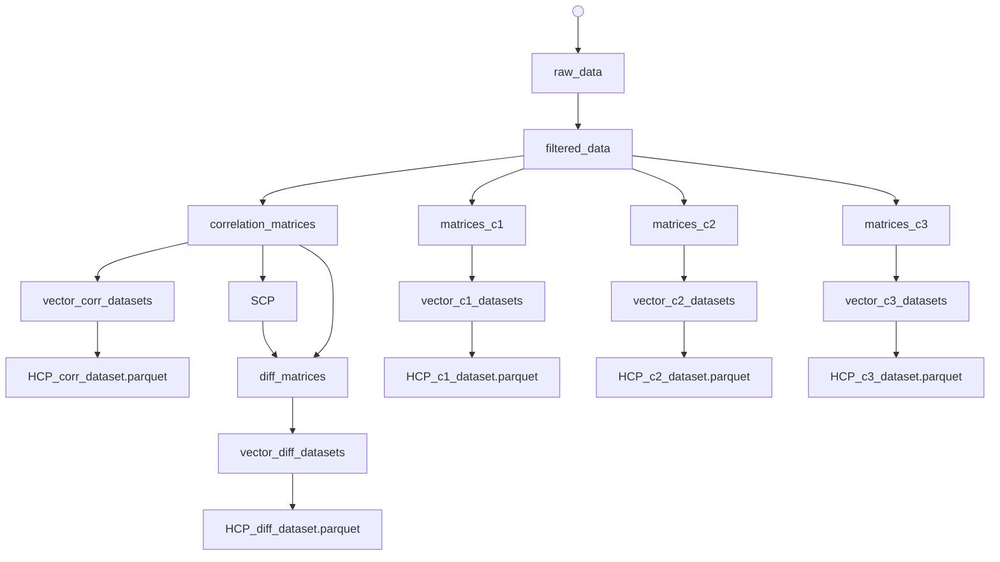

# Tesis: Análisis estadístico de métricas de Machine Learning en datos MEG de conectividad funcional basados en el Patrón de Correlación Estable (SCP)

__Autor__: Francisco Javier Torres Santana.  
__Tutora__: Dra. Paola Vanessa Olguín Rodríguez.  
__Intitución__: Universidad Autónoma del Estado de Morelos.  
__Contacto__: francisco.torressa@uaem.edu.mx.  

Este proyecto corresponde a una tesis de titulación orientada al análisis de datos neurocientíficos y al desarrollo de un flujo reproducible de aprendizaje automático para estudiar patrones de conectividad cerebral a partir de señales de magnetoencefalografía (MEG). El trabajo integra varias etapas de desarrollo:
- Ingesta y procesamiento de datos MEG
- Pipelines de ingeniería de características y construcción de datasets de entrenamientos
- Análisis estadístico y visualización de datos
- Entrenamiento, validación y monitoreo de modelos de clasificación con prácticas de MLOps


## Contexto del problema

El conjunto de datos utilizado proviene del Human Connectome Project S1200, específicamente de la modalidad MEG. Se trabajó con sujetos que presentan registros de tareas como memoria de trabajo y tareas motoras, así como datos de reposo. La hipótesis del proyecto está enfocada en que patrones de conectividad derivados de estas señales pueden aportar información útil para diferenciar estados cognitivos o condiciones experimentales, y que un resta el Patrón de Correlación Estable (SCP por sus siglas en inglés) puede ayudar a mejorar el rendimiento de los modelos de clasificación de Machine Learning. Además, se busca corroborar si los esquemas de reducción C1, C2 y C3, pueden funcionar como métodos de selección de características y reducción de la dimensión 

Las clases que se buscan clasificar son las siguientes siete:
- Estado de reposo
- Memoria de trabajo: 0-back y 2-back
- Tarea motora: movimientos de mano izquierda, mano derecha, pie izquierdo y pie derecho


El proyecto busca corroborar estadísticamente qué características construidas a partir de las matrices de correlación entre canales, mejoran el desempeño de modelos de clasificación de Machine Learning, si las obtenidas a partir de las matrices de correlación o las matrices de diferencia (las matrices de correlación restando las matriz SCP). Así mismo, también se busca corroborar estadísticamente si los esquemas de reducción C1, C2 y C3 mejoran el rendimiento de las métricas de clasificación en comparación con otras técnicas como PCA (análisis de componente principales).


## Estructura del repositorio

La organización del repositorio refleja el flujo completo del proyecto:

- data/: contiene los datos crudos, intermedios y procesados. No disponible en GitHub.
- docs/: documentación adicional sobre los datos y el avance del trabajo de tesis. No disponible en GitHub.
- scripts/: pipelines ejecutables para procesar datos y entrenar modelos.
- src/tesis/: paquete principal con la lógica de ingesta de datos, generación de características, entrenamiento de modelos, evaluación de métricas, visualización de datos y utilidades.
- sandbox/: notebooks exploratorios usados para análisis y pruebas. No disponible en GitHub.
- reports/: resultados, figuras y métricas generadas por los experimentos.

## Requisitos previos

Se recomienda trabajar con Python 3.11 o superior y un entorno virtual. El proyecto está preparado para ejecutarse con uv, aunque también puede instalarse con pip.

### Opción recomendada con uv

```bash
uv sync
``` 

### Si no se tiene uv instalado
```bash
pip install uv
```

### Opción con pip

```bash
python -m venv .venv
source .venv/bin/activate  # en Linux/macOS
.venv\Scripts\activate     # en Windows PowerShell
pip install -e .[dev]
```

Es necesaior también tener un archivo. `.env` en la raíz del proyecto con las credenciales de AWS S3 para poder descargar los datos crudos y la api key Weight & Biases (W&B) para iniciar sesión de manera automática y poder subir los resultados de los experimentos. El archivo `.env` debe contener las siguientes variables de entorno:

```
AWS_ACCESS_KEY_ID=your_access_key
AWS_SECRET_ACCESS_KEY=your_secret_key
WANDB_API_KEY=your_wandb_api_key
```
Las credenciales de AWS S3 se obtienen al crear en la página del HCP en https://balsa.wustl.edu/project?project=HCP_YA. Las credenciales de W&B se obtienen al crear una cuenta en https://wandb.ai/

## Flujo de procesamiento de datos

El proyecto está diseñado para ejecutarse en etapas. Cada etapa produce artefactos intermedios que pueden inspeccionarse y reutilizarse. El siguiente diagrama ilustra el flujo de pipelines de procesamiento de datos y generación de datasets de entrenamiento:


Donde los nodos representan directorios con archivos .parquet. Cada flecha representa un pipeline de procesamiento de datos, el inicio de la flecha conecta los datos de entrada y la punta de la flecha conecta los datos de salida.
Los datasets finales de entrenamiento se encuentran en la carpeta `data/processed/`, los cuales se representan en el diagrama como las hojas del árbol y son los utilizados en los entrenamientos de los modelos.

## Entrenamiento de modelos de clasificación

En esta investigación se entrenan modelos de clasificación supervisada para diferenciar entre las siete clases de interés. Los modelos elegidos más aptos para el estudio fueron la regresión logística y XGBoost, debido a su capacidad de manejar datos de alta dimensionalidad y su interpretabilidad. Para obtener resultados robustos y confiables, se implementa un esquema de validación cruzada canidadda con GroupKFold.
### Ejemplo de entrenamiento con regresión logística

```bash
uv run scripts/run_experiment.py \
  --data_path data/processed/HCP_corr_dataset.parquet \
  --model LogisticRegression \
  --search_type grid \
  --pca true \ 
  --n_jobs 4 \ 
  --start_fold 1  
```

### Ejemplo de entrenamiento con XGBoost

```bash
uv run scripts/run_experiment.py \
  --data_path data/processed/HCP_corr_dataset.parquet \
  --model XGBoost \
  --search_type random \
  --pca true \
  --n_jobs 4 \ 
  --start_fold 1 
```
Los hiperparámetros de los modelos se definen en el archivo `src/tesis/config.py`, y pueden ajustarse según las necesidades del experimento. En este estudio se decidió usar GridSearchCV para la regresión logística y RandomizedSearchCV para XGBoost, debido a la naturaleza de los hiperparámetros de cada modelo y la eficiencia computacional.
Los experimentos de entrenamiento se pueden ejecutar en paralelo, especificando el número de trabajos con el parámetro `--n_jobs`. Además, se puede indicar el fold inicial para continuar un entrenamiento interrumpido con el parámetro `--start_fold`. El valor para el parámetro `--pca` indica si se desea aplicar PCA como técnica de reducción de dimensionalidad antes del entrenamiento del modelo, el cual es true para los datasets de correlación y de diferencia, y false para los datasets de reducción C1, C2 y C3.